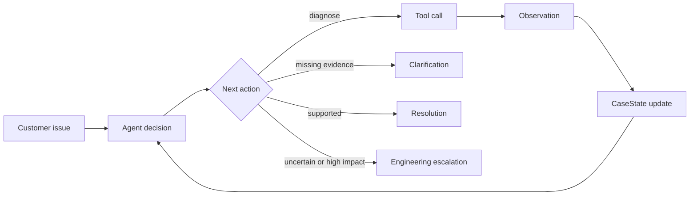

# Support Triage Agent

A small, evidence-led Python agent for technical-support triage. It turns an incomplete customer report into a targeted clarification, supported resolution, or useful engineering escalation.

The default demo is deterministic, offline, and uses only synthetic data. It requires no API credentials and makes no claim to use Alloy APIs, documentation, systems, or customer data.

## Visual interview demo — recommended

Requires Python 3.10 or newer.

```bash
python3 -m venv .venv
source .venv/bin/activate
python -m pip install -r requirements.txt
python -m streamlit run streamlit_app.py
```

Open the local address Streamlit prints, normally `http://localhost:8501`. The visual console is designed for a short interview walkthrough: choose or switch guided cases at any time, show the safe discovery stop, add the bundled customer reply, replay the completed investigation event by event, then inspect the evidence or engineering handoff. Previous, next and re-run controls always create a fresh synthetic case while leaving the three bundled stories unchanged. Mock mode is selected by default and needs no API key.

The interface is tailored to the core behaviours of a Technical Support Engineer **Triage & Discovery** workflow:

- make the first response substantive rather than merely acknowledge the ticket;
- gather the smallest useful set of identifiers, timestamps, impact and environment details;
- isolate API, authentication, platform, delivery and customer-endpoint boundaries;
- keep confirmed facts visibly separate from hypotheses;
- resolve a standard case only when diagnostic evidence supports it; and
- give the next engineer a handoff that does not require discovery to start again.

The role framing is deliberate, but the product remains an independent synthetic portfolio demonstration. It is not connected to Alloy, Zendesk, a bank, or any live customer system.

## Command-line demo

Run all three scenarios without the UI:

```bash
python demo.py
```

Run one scenario with `python demo.py --scenario 1`, `2`, or `3`.

Run the complete test suite:

```bash
python -m pytest -q
```

## What the demo shows

Each trace makes the loop visible:

```text
customer issue
  -> decision
  -> tool call
  -> structured observation
  -> CaseState update
  -> next decision
  -> resolution or escalation
```

The three scenarios are:

| Scenario | Behaviour | Outcome |
|---|---|---|
| Intermittent 401s | Requests a failed request ID, timestamp, and non-secret key ID; checks credential and request evidence | Evidence-bounded resolution for the inspected failure |
| “Our webhook isn’t firing” | Requests event, endpoint, and timing details; inspects delivery attempts and endpoint responses | Endpoint-side diagnosis and safe next step |
| Correlated API and webhook failures | Checks service status, request evidence, webhook evidence, and HTTP semantics | Structured engineering escalation; shared cause remains a hypothesis |

The mock fixtures also cover HTTP 400, 401, 403, 409, 412, 429, and 500-series responses.

## Why this is an agent

This is not one prompt that writes a plausible support answer. A decision adapter selects exactly one next action from current state. Python validates the action, calls an allow-listed tool, records its observation, updates structured state, and supplies that new state to the next decision. Explicit stop conditions end the loop.



Mock mode and optional hosted-model mode use the same `AgentDecision`, tool, state, and stop contracts. Mock mode makes the architecture reproducible; it does not claim to prove hosted-model reasoning quality.

## Architecture

| File | Responsibility |
|---|---|
| `agent.py` | Bounded decide/act/observe/update loop, action validation, tool dispatch, and stopping |
| `state.py` | `CaseState`, customer-input extraction, evidence updates, and append-only audit events |
| `models.py` | Strict Pydantic contracts for decisions, evidence, tool results, audit events, and escalations |
| `tools.py` | Synthetic troubleshooting fixtures and allow-listed tool registry |
| `llm.py` | Replaceable deterministic and OpenAI decision adapters |
| `demo.py` | Three repeatable end-to-end scenarios |
| `streamlit_app.py` | Presenter-friendly Triage & Discovery console over the same agent |
| `tests/` | Behavioural and contract tests |

The deliberately explicit loop is the main design choice: an interviewer can inspect the control flow without learning a large agent framework first.

## Structured state and audit trail

`CaseState` holds the original report, customer context, category, severity, impact, incident timestamps, request/event/non-secret key IDs, HTTP codes, endpoints, confirmed evidence, missing information, hypotheses, actions, tool results, next action, resolution, escalation, status, step count, and audit trail.

The audit trail records customer input, decisions, tool calls, tool results, state updates, guardrail actions, and stops. Processing timestamps are generated by the runtime and kept separate from incident timestamps supplied by the customer or returned by a tool.

## Trust boundaries and guardrails

- Confirmed tool observations are stored as evidence; possible causes remain labelled hypotheses.
- Identifier-dependent tools can use only IDs already supplied by the customer or returned by a successful observation.
- Unknown IDs return an explicit miss without substitute logs or customer data.
- A resolution is rejected unless a successful diagnostic observation supports it.
- Tool names are allow-listed and decisions use strict Pydantic validation.
- The loop has a hard maximum-step limit and escalates when that budget is exhausted.
- Tool/provider failures are audited and fail safely.
- All bundled records, customers, identifiers, logs, and timestamps are synthetic fixtures.

Available tools:

```text
inspect_api_request(request_id)
check_authentication(api_key_id)
inspect_webhook_delivery(event_id)
check_service_status()
lookup_http_status(code)
search_internal_docs(query)
create_engineering_escalation(case_state)
```

An engineering escalation contains impact, symptoms, timestamps, correlation IDs, HTTP codes, relevant evidence, troubleshooting performed, an explicitly qualified likely cause, and outstanding questions.

## Optional hosted-model interface

The optional OpenAI adapter uses the Responses API through the isolated decision interface:

```bash
python -m pip install -e '.[openai]'
export OPENAI_API_KEY="your-key"
python demo.py --provider openai
```

Do not commit or paste API secrets into the app. Hosted mode is nondeterministic, may incur usage, and is not needed for the verified interview demo.

## Tests

The suite checks that:

- every tool returns a structured result;
- all required HTTP and webhook fixtures are reachable;
- observations update state and emit explicit state-update events;
- failed/unknown lookups cannot seed identifier provenance;
- the next decision sees the previous tool result;
- unsupported resolutions and fabricated tool arguments are blocked;
- an awaiting-customer case does not spin;
- the maximum-step limit has no off-by-one call;
- the 401 and webhook paths behave sensibly; and
- escalation output satisfies the complete typed contract;
- an active case can switch directly to any other guided scenario without leaking state;
- previous, next and re-run controls create the correct fresh case; and
- the interactive completed-trace replay remains available after switching and resuming.

## Interview explanation

### 30 seconds

> I built a support-triage agent that turns an incomplete customer report into an evidence-backed resolution, clarification request, or engineering escalation. A decision adapter chooses one action, Python validates and calls a typed diagnostic tool, the observation updates a structured case record, and the loop repeats until an explicit stop. Confirmed evidence is separate from hypotheses, identifiers cannot be invented, every action is auditable, and a hard step limit prevents runaway execution. The included demo is deterministic, credential-free, and entirely synthetic.

### 90 seconds

> The core is a small Python orchestration loop rather than a large framework. A customer report creates a Pydantic `CaseState` containing supplied identifiers, impact, timestamps, confirmed evidence, missing information, hypotheses, actions, and status. On each iteration, a replaceable decision adapter returns one typed action: ask for information, call a diagnostic, resolve, or escalate. The runtime validates that action, enforces identifier provenance, dispatches an allow-listed tool, stores the structured observation, emits an audit event, and passes the updated state into the next decision.
>
> The model is treated as a policy layer, not a source of operational truth. Tools provide evidence; possible causes remain hypotheses. A resolution needs supporting diagnostic evidence, while conflicting or incomplete high-impact cases become engineering escalations. The step budget is enforced outside the model. Mock mode exercises the same contracts as the optional hosted adapter, which makes the three interview scenarios and behavioural test suite repeatable without credentials. Production work would replace fixtures with authenticated service adapters and add durable storage, redaction, tenant isolation, timeouts, tracing, and human approval for consequential actions.

## Three design decisions to defend

1. **Keep the loop explicit.** The control flow and stop conditions are easy to read, debug, and test.
2. **Use typed, replaceable boundaries.** Pydantic contracts constrain decisions and observations; provider choice does not leak into domain logic.
3. **Make evidence discipline part of state.** Evidence, hypotheses, missing information, and actions cannot silently collapse into one plausible narrative.

## Likely questions

**Is deterministic mock mode really agentic?**  
It proves the orchestration: repeated decisions, tool dispatch, observations, state transitions, and stopping. It does not prove a hosted model’s reasoning quality; that needs a labelled evaluation set.

**Why not LangChain or LangGraph?**  
For this scope, the hand-written loop exposes more engineering understanding with fewer dependencies. A graph framework becomes useful when persistence, branching workflows, or many integrations justify it.

**How does it reduce hallucination risk?**  
Operational facts come from customer input or tool observations, identifier arguments need provenance, hypotheses have their own field, and uncertainty can end in clarification or escalation.

**What would productionisation require?**  
Authenticated adapters, durable event/case storage, tenant isolation, PII and secret redaction, timeouts and circuit breakers, tracing and metrics, evaluation gates, retention controls, and approval boundaries for writes.

## Limitations

- Diagnostics and customers are synthetic; there are no live log, status, webhook, or ticketing integrations.
- Mock mode validates deterministic orchestration, not general reasoning on unseen incidents.
- State is local and in-memory, not a concurrent or durable case store.
- The visual UI is a presenter layer over the same in-memory agent, not a production case-management system.
- This is a portfolio architecture, not a production security boundary.

MIT licensed; see `LICENSE`.
