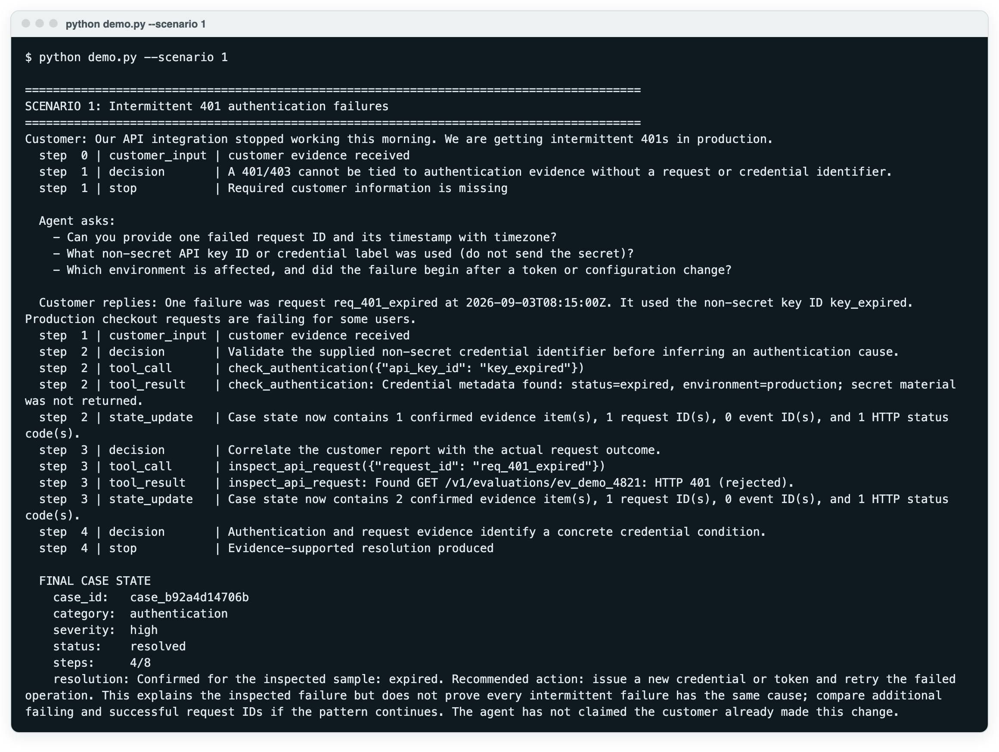
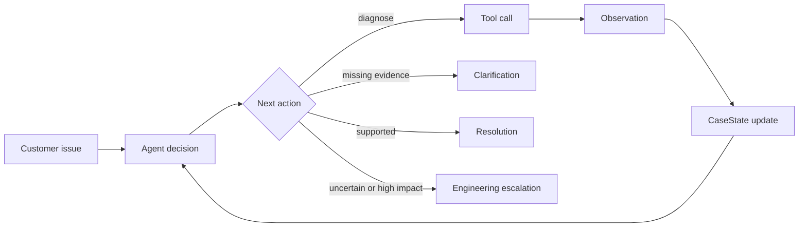

# Support Triage Agent

A tool-using triage agent for API and webhook support incidents, plus an
interactive training simulator that uses the same synthetic diagnostic tools.
Everything runs offline with no API key; OpenAI is optional. In the offline
demo, driven by the deterministic mock adapter, the agent resolves two of three
scenarios and escalates the third to engineering
([results](#result-offline-demo)); all 66 tests pass without a key.

- **Bounded tool loop.** At each step a decision adapter returns exactly one
  `AgentDecision` (ask the customer, call a tool, resolve or escalate). It is a
  strict Pydantic model: unknown fields are rejected and each action must carry
  its required payload. Python then checks identifier arguments (request,
  event and key IDs, HTTP codes) against values the customer or a successful
  tool observation has supplied, runs an allow-listed tool, writes the
  observation into `CaseState`, and escalates if the step budget (default 8)
  runs out.
- **Structured outputs.** The optional OpenAI adapter requests the same
  `AgentDecision` schema through the Responses API
  (`responses.parse(text_format=AgentDecision)`); the deterministic mock
  adapter returns the same type, so both use one loop, one set of tools and one
  set of stop rules.
- **Training simulator.** A Streamlit support-shift console in which a person,
  not the agent, works a live ticket queue against the same fixture-backed
  tools, plus a lighter static browser showcase with three prebuilt scenarios.



*Captured run of `python demo.py --scenario 1` in the default mock mode with no API key (raw output in [`docs/images/demo-scenario-1.txt`](docs/images/demo-scenario-1.txt)). It is scenario 1 of the three summarised below; the customer, identifiers and logs are synthetic fixtures.*

## System architecture


*Purple: model call · blue: deterministic code · green: human · amber: evaluation · grey: storage · dashed: external, optional, mocked or planned*

`python demo.py` passes each synthetic issue and its scripted customer
follow-ups to the bounded loop in `agent.py`. At each step the loop gives a copy
of `CaseState` to a decision adapter (the rule-based mock by default, OpenAI
only when selected and given a key), checks the returned `AgentDecision`
against identifier-provenance and evidence rules, runs one allow-listed tool
from `tools.py` and writes the observation back to `CaseState`. It stops when
it asks the customer, resolves, escalates or reaches the 8-step budget. The
Streamlit simulator does not use this loop: a human trainee chooses actions or
types replies, `simulation.py` scores them and calls the same fixture-backed
tools, and the customer is scripted unless Live AI customer mode is on. The
static browser showcase in `web/` is a separate JavaScript demo with its own
scenario data and is not shown; [Architecture](#architecture) maps each file.

## How AI is used

- **Default path: no model call.** `python demo.py`, the test suite and the
  Streamlit "Scenario engine" make no model calls. `MockDecisionAdapter` is a
  rule-based stand-in that returns the same `AgentDecision` type as the model
  adapter, and the scripted customer uses fixed replies and keyword checks.
- **Optional decision model.** `python demo.py --provider openai` uses
  `OpenAIResponsesAdapter` (`OPENAI_API_KEY`; model from `OPENAI_MODEL`,
  default `gpt-5.4-mini`) through `responses.parse(text_format=AgentDecision)`.
  It sees `CaseState` without the audit trail, the six diagnostic tool schemas
  and the remaining step count, and returns one action: ask, call a tool,
  resolve or escalate. It does not run tools itself.
- **Optional customer model.** In Live AI customer mode, `generate_live_case`
  rewrites names and wording of a fixture case, and `OpenAICustomerSimulator`
  gets the case facts, the last eight messages, the trainee's message and the
  observed tool results. It returns a structured `CustomerEvaluation`: for a
  clicked choice only its reply is used, while for a typed reply its coaching,
  score change and advance flag are applied too. The key is entered in the
  sidebar and held only in the Streamlit session.
- **What stays deterministic.** Python checks that tool arguments match
  identifiers already seen, runs only allow-listed tools over synthetic
  fixtures, rejects resolutions without supporting evidence, builds the
  escalation and enforces the step budget. In the simulator only Python runs
  diagnostics, and a typed reply cannot move a case past diagnosis or response
  without a successful tool result. See
  [Trust boundaries and guardrails](#trust-boundaries-and-guardrails).
- **Evaluation and fallbacks.** The 66 offline tests use the mock adapter,
  scripted sequence adapters and Streamlit `AppTest`; the OpenAI paths are not
  tested and no live-model results are reported (see
  [Limitations](#limitations)). If the decision adapter raises, the error is
  audited and the case is escalated; if the escalation tool fails, a fallback
  escalation lists the unknowns.

## Result: offline demo

`python demo.py` runs three scenarios with the deterministic mock adapter:

| Scenario | Outcome | Steps used |
|---|---|---|
| 1. Intermittent 401 authentication failures | Resolved after one round of clarifying questions: expired credential confirmed for the inspected request | 4 of 8 |
| 2. Webhook "not firing"; endpoint returns 5xx | Resolved after one round of clarifying questions: event was sent, customer endpoint failed | 4 of 8 |
| 3. Correlated API 500 and webhook failure | Escalated to engineering with a typed handoff; shared cause kept as a hypothesis | 5 of 8 |

Two resolved, one escalated. These outcomes are asserted in
`tests/test_agent.py`, and the full suite of 66 tests runs offline.

## Quick start

Requires Python 3.10 or newer.

```bash
python3 -m venv .venv
source .venv/bin/activate
python -m pip install -r requirements.txt

python demo.py                 # autonomous agent, three scenarios (or --scenario 1|2|3)
python -m pytest -q            # 66 tests, no network or API key
python -m streamlit run streamlit_app.py --server.port 8503   # training simulator
npm run dev                    # static browser showcase on port 4173, no install needed
```

## Training simulator (Streamlit)

Run `python -m streamlit run streamlit_app.py --server.port 8503` and open
`http://127.0.0.1:8503`. Incoming API and webhook incidents build up in a live
queue; the console starts with four cases.
Accept any ticket, then either select one of five possible support actions or
write your own response in the chat box. Strong discovery reveals the exact
synthetic identifiers required for diagnosis. The appropriate diagnostic
returns structured evidence. The final stage tests whether you can explain the
finding, bound its scope, and own the resolution or engineering escalation.

The queue includes authentication, permissions, rate limiting, webhook,
idempotency, precondition and internal-error cases. **Auto-arrivals** can add a
new ticket every 20 seconds while the page is open. Every decision affects the
support score and customer mood; wrong answers create realistic consequences
without making the case unrecoverable.

The interface models the triage and discovery stage of a technical-support workflow: identify the customer, verify identifiers, act within tool bounds, escalate with evidence:

- make the first response substantive rather than merely acknowledge the ticket;
- gather the smallest useful set of identifiers, timestamps, impact and environment details;
- isolate API, authentication, platform, delivery and customer-endpoint boundaries;
- keep confirmed facts visibly separate from hypotheses;
- resolve a standard case only when diagnostic evidence supports it; and
- give the next engineer a handoff that does not require discovery to start again.

Optional **Live AI customer** mode uses OpenAI to generate fresh customer
wording and react to the trainee's exact messages, again through structured
Responses API output. The model can change the conversation, but it cannot
change fixture-backed IDs, logs, HTTP statuses or the required resolution.

### Enable real AI customer interactions

1. Start the app normally.
2. In the sidebar, set **Customer engine** to **Live AI customer**.
3. Paste your OpenAI API key into the password field in the local app, not into
   source code, GitHub or a screenshot.
4. Click **Generate AI incident**, accept it, and reply normally.

The key is held only in the running Streamlit session and is not written to the
project. Live mode may incur API usage. Use synthetic content only.

All scenarios, customers, identifiers and logs are synthetic. The project is not connected to any ticketing or live customer system.

## Browser showcase

The repository also includes a credential-free web showcase for a quick
walkthrough. It opens on a ticket menu with three prebuilt
scenarios, then moves into the same discovery → diagnosis → resolution flow.

```bash
npm run dev
```

Open `http://127.0.0.1:4173`. No package installation or API key is required.
The browser showcase uses synthetic scenario data and transparent keyword
scoring for typed replies; the Streamlit app above remains the full Python
simulation with optional OpenAI customer interactions.

## What the project shows

The UI and autonomous agent demonstrate two complementary loops:

- Interactive training: incoming case → trainee reply or choice → customer
  reaction → diagnostic evidence → score/state update → next stage → outcome.
- Autonomous agent: customer issue → decision → tool call → observation →
  CaseState update → next decision → resolution or escalation.

Each trace makes the loop visible:

```text
customer issue
  -> decision
  -> tool call
  -> structured observation
  -> CaseState update
  -> next decision
  -> resolution or escalation
```

The command-line agent includes three repeatable scenarios:

| Scenario | Behaviour | Outcome |
|---|---|---|
| Intermittent 401s | Requests a failed request ID, timestamp, and non-secret key ID; checks credential and request evidence | Evidence-bounded resolution for the inspected failure |
| “Our webhook isn’t firing” | Requests event, endpoint, and timing details; inspects delivery attempts and endpoint responses | Endpoint-side diagnosis and safe next step |
| Correlated API and webhook failures | Checks service status, request evidence, webhook evidence, and HTTP semantics | Structured engineering escalation; shared cause remains a hypothesis |

The mock fixtures also cover HTTP 400, 401, 403, 409, 412, 429, and 500-series responses.

## Why this is an agent

This is not one prompt that writes a plausible support answer. A decision adapter selects exactly one next action from current state. Python validates the action, calls an allow-listed tool, records its observation, updates structured state, and supplies that new state to the next decision. Explicit stop conditions end the loop.



Mock mode and optional hosted-model mode use the same `AgentDecision`, tool, state, and stop contracts. Mock mode makes the architecture reproducible; it does not claim to prove hosted-model reasoning quality.

## Architecture

| File | Responsibility |
|---|---|
| `agent.py` | Bounded decide/act/observe/update loop, action validation, tool dispatch, and stopping |
| `state.py` | `CaseState`, customer-input extraction, evidence updates, and append-only audit events |
| `models.py` | Strict Pydantic contracts for decisions, evidence, tool results, audit events, and escalations |
| `tools.py` | Synthetic troubleshooting fixtures and allow-listed tool registry |
| `llm.py` | Replaceable deterministic and OpenAI decision adapters |
| `simulation.py` | Incoming queue cases, five-choice training loop, customer simulation, scoring, and optional OpenAI customer |
| `demo.py` | Three repeatable end-to-end scenarios |
| `streamlit_app.py` | Interactive support-shift queue, customer chat, SLA, choices, evidence, and scorecard |
| `tests/` | Behavioural and contract tests |

The deliberately explicit loop is the main design choice: a reader can inspect the control flow without learning a large agent framework first.

## Structured state and audit trail

`CaseState` holds the original report, customer context, category, severity, impact, incident timestamps, request/event/non-secret key IDs, HTTP codes, endpoints, confirmed evidence, missing information, hypotheses, actions, tool results, next action, resolution, escalation, status, step count, and audit trail.

The audit trail records customer input, decisions, tool calls, tool results, state updates, guardrail actions, and stops. Processing timestamps are generated by the runtime and kept separate from incident timestamps supplied by the customer or returned by a tool.

## Trust boundaries and guardrails

- Confirmed tool observations are stored as evidence; possible causes remain labelled hypotheses.
- Identifier-dependent tools can use only IDs already supplied by the customer or returned by a successful observation.
- Unknown IDs return an explicit miss without substitute logs or customer data.
- A resolution is rejected unless a successful diagnostic observation supports it.
- Tool names are allow-listed and decisions use strict Pydantic validation.
- The loop has a hard maximum-step limit and escalates when that budget is exhausted.
- Tool/provider failures are audited and fail safely.
- All bundled records, customers, identifiers, logs, and timestamps are synthetic fixtures.

Available tools:

```text
inspect_api_request(request_id)
check_authentication(api_key_id)
inspect_webhook_delivery(event_id)
check_service_status()
lookup_http_status(code)
search_internal_docs(query)
create_engineering_escalation(case_state)
```

An engineering escalation contains impact, symptoms, timestamps, correlation IDs, HTTP codes, relevant evidence, troubleshooting performed, an explicitly qualified likely cause, and outstanding questions.

## Optional hosted autonomous-agent interface

The visual app's Live AI customer mode is configured in its sidebar. Separately,
the autonomous CLI agent can use an OpenAI decision adapter through the
Responses API:

```bash
export OPENAI_API_KEY="your-key"
python demo.py --provider openai
```

Do not commit API secrets or paste them into source code, GitHub or
screenshots. Hosted mode is nondeterministic, may incur usage, and is not needed for
the offline demo or the test suite.

## Tests

`python -m pytest -q` runs 66 tests offline. The suite checks that:

- every tool returns a structured result;
- all required HTTP and webhook fixtures are reachable;
- observations update state and emit explicit state-update events;
- failed/unknown lookups cannot seed identifier provenance;
- the next decision sees the previous tool result;
- unsupported resolutions and fabricated tool arguments are blocked;
- an awaiting-customer case does not spin;
- the maximum-step limit has no off-by-one call;
- the 401 and webhook paths behave sensibly;
- escalation output satisfies the complete typed contract;
- every active training stage presents exactly five choices and one strongest action;
- safe choices progress discovery, diagnosis and response while unsafe choices do not;
- free-text replies can drive the same fixture-backed diagnostic path;
- the live queue accepts and adds incidents without leaking case state; and
- completed cases produce a scorecard and remain recorded in the shift history.

## Design decisions

1. **Keep the loop explicit.** The control flow and stop conditions are easy to read, debug and test. A graph framework such as LangGraph becomes useful when persistence, branching workflows or many integrations justify it; at this scope a hand-written loop needs fewer dependencies.
2. **Use typed, replaceable boundaries.** Pydantic contracts constrain decisions and observations; provider choice does not leak into domain logic.
3. **Make evidence discipline part of state.** Evidence, hypotheses, missing information and actions cannot silently collapse into one plausible narrative.

## Limitations

- Diagnostics and customers are synthetic; there are no live log, status, webhook, or ticketing integrations.
- Mock mode validates deterministic orchestration, not general reasoning on unseen incidents.
- The OpenAI paths (`OpenAIResponsesAdapter` in `llm.py`, and `OpenAICustomerSimulator` and `generate_live_case` in `simulation.py`) are not covered by the test suite, and no live-model results are included; every result in this README comes from the mock adapter.
- State is local and in-memory, not a concurrent or durable case store.
- The visual UI is an in-memory training simulator, not a production ticketing or case-management system.
- Live AI mode generates language and coaching, but all operational truth is constrained to synthetic fixtures.
- The app has no durable user accounts, team scoring, real ticket ingestion, or authenticated production adapters.
- This is a demonstration architecture, not a production security boundary.

MIT licensed; see `LICENSE`.
