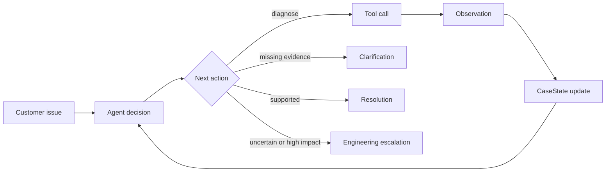

# Support Triage Agent

An interactive Technical Support Engineer simulation and an inspectable Python
triage agent. Incoming API and webhook incidents build up in a live queue. The
trainee accepts a case, talks to a synthetic customer, chooses one of five
shuffled actions at each stage, runs fixture-backed diagnostics, and receives
customer reactions, coaching, a score, and an evidence-based outcome.

Optional **Live AI customer** mode uses OpenAI to generate fresh customer
wording and react to the trainee's exact messages. The model can change the
conversation, but it cannot change fixture-backed IDs, logs, HTTP statuses or
the required resolution. The fully interactive scenario engine remains
available offline with no credentials.

## Run the interactive simulation — recommended

Requires Python 3.10 or newer.

```bash
python3 -m venv .venv
source .venv/bin/activate
python -m pip install -r requirements.txt
python -m streamlit run streamlit_app.py --server.port 8503
```

Open `http://127.0.0.1:8503`. The console starts with four incoming cases.
Accept any ticket, then either select one of five possible support actions or
write your own response in the chat box. Strong discovery reveals the exact
synthetic identifiers required for diagnosis. The appropriate diagnostic
returns structured evidence. The final stage tests whether you can explain the
finding, bound its scope, and own the resolution or engineering escalation.

The queue includes authentication, permissions, rate limiting, webhook,
idempotency, precondition and internal-error cases. **Auto-arrivals** can add a
new ticket every 20 seconds while the page is open. Every decision affects the
support score and customer mood; wrong answers create realistic consequences
without making the case unrecoverable.

The interface is tailored to the core behaviours of a Technical Support Engineer **Triage & Discovery** workflow:

- make the first response substantive rather than merely acknowledge the ticket;
- gather the smallest useful set of identifiers, timestamps, impact and environment details;
- isolate API, authentication, platform, delivery and customer-endpoint boundaries;
- keep confirmed facts visibly separate from hypotheses;
- resolve a standard case only when diagnostic evidence supports it; and
- give the next engineer a handoff that does not require discovery to start again.

### Enable real AI customer interactions

1. Start the app normally.
2. In the sidebar, set **Customer engine** to **Live AI customer**.
3. Paste your OpenAI API key into the password field in the local app—not into
   source code, GitHub, a screenshot, or this chat.
4. Click **Generate AI incident**, accept it, and reply normally.

The key is held only in the running Streamlit session and is not written to the
project. Live mode may incur API usage. Use synthetic content only.

The role framing is deliberate, but the product remains an independent synthetic portfolio demonstration. It is not connected to Alloy, Zendesk, a bank, or any live customer system.

## Run the compact browser showcase

The repository also includes a credential-free web showcase designed for a
quick portfolio walkthrough. It opens on a ticket menu with three prebuilt
scenarios, then moves into the same discovery → diagnosis → resolution flow.

```bash
npm run dev
```

Open `http://127.0.0.1:4173`. No package installation or API key is required.
The browser showcase uses synthetic scenario data and transparent keyword
scoring for typed replies; the Streamlit app above remains the full Python
simulation with optional OpenAI customer interactions.

## Command-line demo

Run all three scenarios without the UI:

```bash
python demo.py
```

Run one scenario with `python demo.py --scenario 1`, `2`, or `3`.

Run the complete test suite:

```bash
python -m pytest -q
```

## What the project shows

The UI and autonomous agent demonstrate two complementary loops:

- Interactive training: incoming case → trainee reply or choice → customer
  reaction → diagnostic evidence → score/state update → next stage → outcome.
- Autonomous agent: customer issue → decision → tool call → observation →
  CaseState update → next decision → resolution or escalation.

Each trace makes the loop visible:

```text
customer issue
  -> decision
  -> tool call
  -> structured observation
  -> CaseState update
  -> next decision
  -> resolution or escalation
```

The command-line agent includes three repeatable scenarios:

| Scenario | Behaviour | Outcome |
|---|---|---|
| Intermittent 401s | Requests a failed request ID, timestamp, and non-secret key ID; checks credential and request evidence | Evidence-bounded resolution for the inspected failure |
| “Our webhook isn’t firing” | Requests event, endpoint, and timing details; inspects delivery attempts and endpoint responses | Endpoint-side diagnosis and safe next step |
| Correlated API and webhook failures | Checks service status, request evidence, webhook evidence, and HTTP semantics | Structured engineering escalation; shared cause remains a hypothesis |

The mock fixtures also cover HTTP 400, 401, 403, 409, 412, 429, and 500-series responses.

## Why this is an agent

This is not one prompt that writes a plausible support answer. A decision adapter selects exactly one next action from current state. Python validates the action, calls an allow-listed tool, records its observation, updates structured state, and supplies that new state to the next decision. Explicit stop conditions end the loop.



Mock mode and optional hosted-model mode use the same `AgentDecision`, tool, state, and stop contracts. Mock mode makes the architecture reproducible; it does not claim to prove hosted-model reasoning quality.

## Architecture

| File | Responsibility |
|---|---|
| `agent.py` | Bounded decide/act/observe/update loop, action validation, tool dispatch, and stopping |
| `state.py` | `CaseState`, customer-input extraction, evidence updates, and append-only audit events |
| `models.py` | Strict Pydantic contracts for decisions, evidence, tool results, audit events, and escalations |
| `tools.py` | Synthetic troubleshooting fixtures and allow-listed tool registry |
| `llm.py` | Replaceable deterministic and OpenAI decision adapters |
| `simulation.py` | Incoming queue cases, five-choice training loop, customer simulation, scoring, and optional OpenAI customer |
| `demo.py` | Three repeatable end-to-end scenarios |
| `streamlit_app.py` | Interactive support-shift queue, customer chat, SLA, choices, evidence, and scorecard |
| `tests/` | Behavioural and contract tests |

The deliberately explicit loop is the main design choice: an interviewer can inspect the control flow without learning a large agent framework first.

## Structured state and audit trail

`CaseState` holds the original report, customer context, category, severity, impact, incident timestamps, request/event/non-secret key IDs, HTTP codes, endpoints, confirmed evidence, missing information, hypotheses, actions, tool results, next action, resolution, escalation, status, step count, and audit trail.

The audit trail records customer input, decisions, tool calls, tool results, state updates, guardrail actions, and stops. Processing timestamps are generated by the runtime and kept separate from incident timestamps supplied by the customer or returned by a tool.

## Trust boundaries and guardrails

- Confirmed tool observations are stored as evidence; possible causes remain labelled hypotheses.
- Identifier-dependent tools can use only IDs already supplied by the customer or returned by a successful observation.
- Unknown IDs return an explicit miss without substitute logs or customer data.
- A resolution is rejected unless a successful diagnostic observation supports it.
- Tool names are allow-listed and decisions use strict Pydantic validation.
- The loop has a hard maximum-step limit and escalates when that budget is exhausted.
- Tool/provider failures are audited and fail safely.
- All bundled records, customers, identifiers, logs, and timestamps are synthetic fixtures.

Available tools:

```text
inspect_api_request(request_id)
check_authentication(api_key_id)
inspect_webhook_delivery(event_id)
check_service_status()
lookup_http_status(code)
search_internal_docs(query)
create_engineering_escalation(case_state)
```

An engineering escalation contains impact, symptoms, timestamps, correlation IDs, HTTP codes, relevant evidence, troubleshooting performed, an explicitly qualified likely cause, and outstanding questions.

## Optional hosted autonomous-agent interface

The visual app's Live AI customer mode is configured in its sidebar. Separately,
the autonomous CLI agent can use an OpenAI decision adapter through the
Responses API:

```bash
export OPENAI_API_KEY="your-key"
python demo.py --provider openai
```

Do not commit API secrets or paste them into source code, GitHub, screenshots or
chat. Hosted mode is nondeterministic, may incur usage, and is not needed for
the verified offline interview flow.

## Tests

The suite checks that:

- every tool returns a structured result;
- all required HTTP and webhook fixtures are reachable;
- observations update state and emit explicit state-update events;
- failed/unknown lookups cannot seed identifier provenance;
- the next decision sees the previous tool result;
- unsupported resolutions and fabricated tool arguments are blocked;
- an awaiting-customer case does not spin;
- the maximum-step limit has no off-by-one call;
- the 401 and webhook paths behave sensibly; and
- escalation output satisfies the complete typed contract;
- every active training stage presents exactly five choices and one strongest action;
- safe choices progress discovery, diagnosis and response while unsafe choices do not;
- free-text replies can drive the same fixture-backed diagnostic path;
- the live queue accepts and adds incidents without leaking case state; and
- completed cases produce a scorecard and remain recorded in the shift history.

## Interview explanation

### 30 seconds

> I built an interactive support-engineering simulator backed by a real triage agent. Incidents arrive in a live queue; I can talk to the customer or choose one of five actions, run fixture-backed diagnostics, and get scored on discovery, evidence use and escalation judgement. Optional OpenAI mode generates fresh customer wording and reacts to what I actually say, but it cannot invent logs or change the underlying case truth. The autonomous agent uses the same typed tools and evidence guardrails to reach an explicit resolution, clarification or engineering handoff.

### 90 seconds

> The project has two connected loops. In the training loop, a trainee accepts a timed incoming case, writes a customer message or chooses one of five shuffled actions, receives a customer reaction and coaching, runs the appropriate diagnostic, and progresses through discovery, diagnosis and response. In Live AI mode, the Responses API produces structured customer reactions and fresh incident phrasing. The prompt supplies the exact synthetic case truth, and Python keeps identifiers, logs, scores, tools and stage transitions outside the model.
>
> Separately, the autonomous agent creates a Pydantic `CaseState` and repeatedly asks a replaceable decision adapter for exactly one action: ask, call a tool, resolve or escalate. Python validates identifier provenance, dispatches an allow-listed tool, records the observation and audit event, and supplies the updated state to the next decision. The model is a language and policy layer, never the source of operational truth. A resolution needs supporting evidence; conflicting or high-impact uncertainty becomes an engineering escalation. Production work would replace fixtures with authenticated adapters and add durable storage, tenant isolation, redaction, tracing, timeouts and human approval for consequential writes.

## Three design decisions to defend

1. **Keep the loop explicit.** The control flow and stop conditions are easy to read, debug, and test.
2. **Use typed, replaceable boundaries.** Pydantic contracts constrain decisions and observations; provider choice does not leak into domain logic.
3. **Make evidence discipline part of state.** Evidence, hypotheses, missing information, and actions cannot silently collapse into one plausible narrative.

## Likely questions

**Is the offline customer mode really interactive?**

Yes: the trainee chooses or writes every action, the customer reacts, the score and mood change, diagnostics execute, and the case advances only when the current support objective is met. It is deterministic, however; use Live AI customer mode to demonstrate model-generated language and reactions.

**Is deterministic mock mode really agentic?**

The separate autonomous CLI loop proves repeated decisions, tool dispatch, observations, state transitions, and stopping. It does not prove hosted-model reasoning quality; that needs a labelled evaluation set.

**Why not LangChain or LangGraph?**

For this scope, the hand-written loop exposes more engineering understanding with fewer dependencies. A graph framework becomes useful when persistence, branching workflows, or many integrations justify it.

**How does it reduce hallucination risk?**

Operational facts come from customer input or tool observations, identifier arguments need provenance, hypotheses have their own field, and uncertainty can end in clarification or escalation.

**What would productionisation require?**

Authenticated adapters, durable event/case storage, tenant isolation, PII and secret redaction, timeouts and circuit breakers, tracing and metrics, evaluation gates, retention controls, and approval boundaries for writes.

## Limitations

- Diagnostics and customers are synthetic; there are no live log, status, webhook, or ticketing integrations.
- Mock mode validates deterministic orchestration, not general reasoning on unseen incidents.
- State is local and in-memory, not a concurrent or durable case store.
- The visual UI is an in-memory training simulator, not a production ticketing or case-management system.
- Live AI mode generates language and coaching, but all operational truth is constrained to synthetic fixtures.
- The app has no durable user accounts, team scoring, real ticket ingestion, or authenticated production adapters.
- This is a portfolio architecture, not a production security boundary.

MIT licensed; see `LICENSE`.
